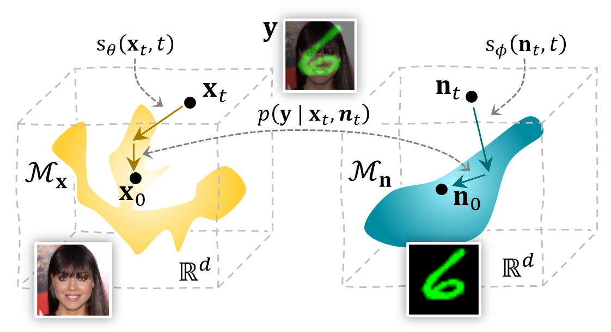
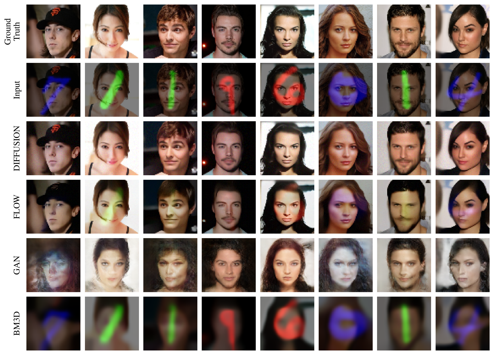
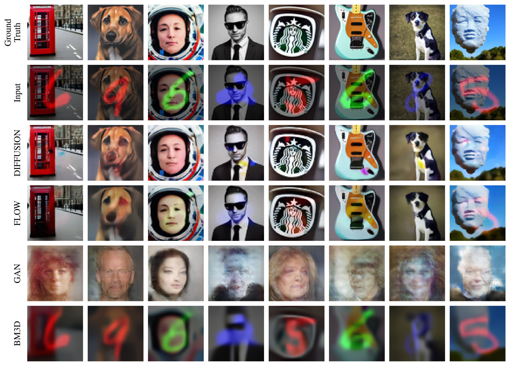
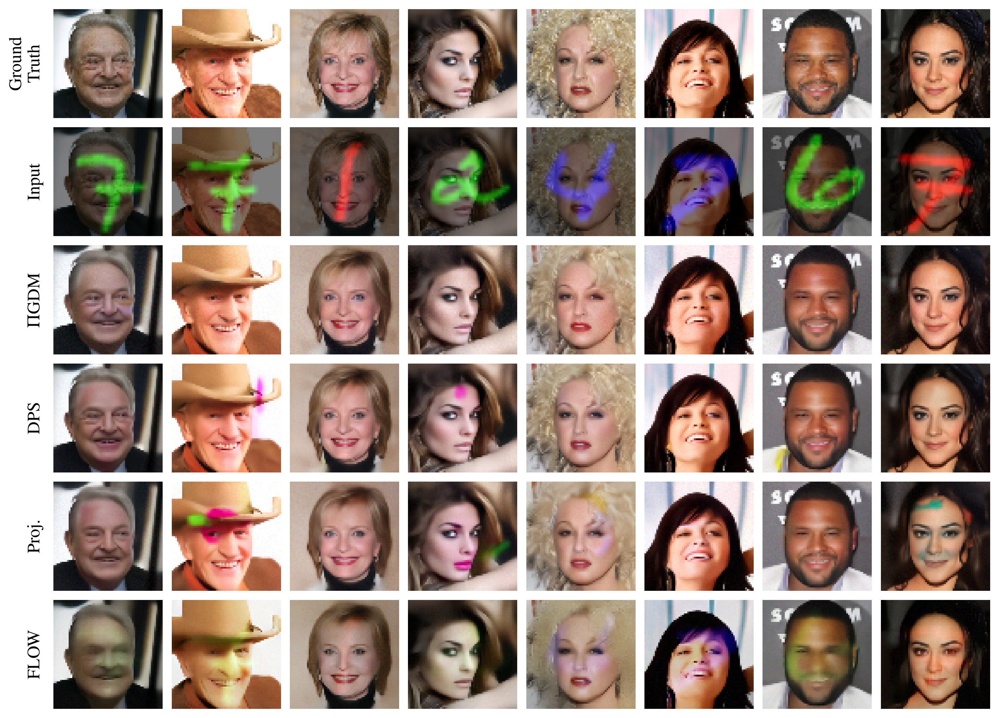
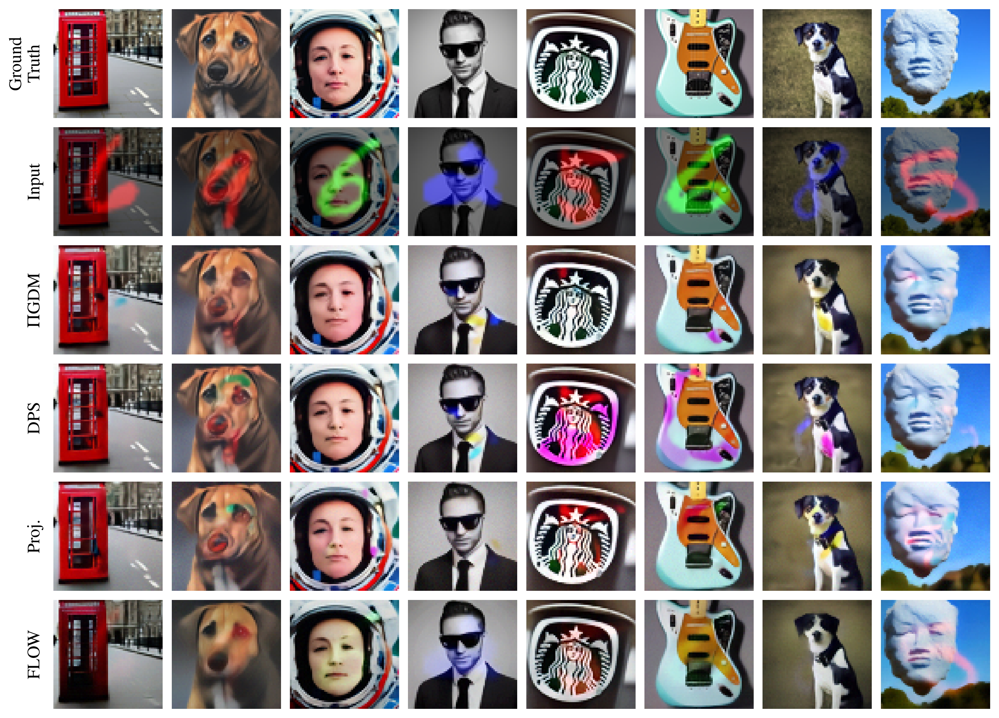

# Removing Structured Noise with Diffusion Models
Official repository of the Removing Structured Noise with Diffusion Models [paper](https://arxiv.org/abs/2302.05290).
The joint posterior sampling functions for diffusion models proposed in the paper can be found in [sampling.py](./generators/SGM/sampling.py) and [guidance.py](./generators/SGM/guidance.py). For the interested reader, a more in depth explanation of the method and underlying principles can be found [here](https://tristan-deep.github.io/posts/2023/03/diffusion-models/). Any information on how to setup the code and run inference can be found in the [inference](#inference) section of this README.

If you find the code useful for your research, please cite the paper:
```bib
@article{stevens2023removing,
  title={Removing Structured Noise with Diffusion Models},
  author={Stevens, Tristan S. W. and van Gorp, Hans
  and Meral, Faik C. and Shin, Junseob and Yu, Jason
  and Robert, Jean-Luc and van Sloun, Ruud J. G.},
  journal={arXiv preprint arXiv:2302.05290},
  year={2023}
}
```
<p align="center">
<td> 
<h5 align="center">Overview of the proposed joint posterior sampling method for removing structured noise using diffusion models.</h5> </td>
</p>


## Table of contents
- [Removing Structured Noise with Diffusion Models](#removing-structured-noise-with-diffusion-models)
  - [Table of contents](#table-of-contents)
  - [Structured denoising](#structured-denoising)
      - [Structured denoising on CelebA with MNIST corruption](#structured-denoising-on-celeba-with-mnist-corruption)
      - [Projection, DPS, PiGDM and Flow](#projection-dps-pigdm-and-flow)
  - [Getting started](#getting-started)
    - [Install environment](#install-environment)
    - [Download weights](#download-weights)
    - [Run inference](#run-inference)
    - [Inference configs](#inference-configs)
    - [Datasets](#datasets)
    - [Installation environment](#installation-environment)

## Structured denoising

Run the following command with  `keep_track` set to `true` in the [config](./configs/inference/paper/celeba_mnist_pigdm.yaml) to run the structured denoising and generate the animation.
```bash
python inference.py -e paper/celeba_mnist_pigdm -t denoise -m sgm
```

<p align="center">
<td> 
<h5 align="center">Structured denoising with the joint diffusion method</h5> </td>
</p>

#### Structured denoising on CelebA with MNIST corruption
<p align="center">
<table><tr>
<td> 
<h5 align="center">CelebA</h5> </td>
<td> 
<h5 align="center">Out-of-distribution dataset</h5> </td>
</tr></table>
</p>

#### Projection, DPS, PiGDM and Flow

<p align="center">
<table><tr>
<td> 
<h5 align="center">CelebA</h5> </td>
<td> 
<h5 align="center">Out-of-distribution dataset</h5> </td>
</tr></table>
</p>

## Getting started
### Install environment
Install an environment with TF2.10 and Pytorch, both GPU enabled. All the other dependencies can be found in the [requirements](./requirements) folder. See [installation environment](#installation-environment) for more detailed instructions.
### Download weights
Pretrained weights should be automatically downloaded to the [./checkpoints](./checkpoints) folder, but can also be manually downloaded [here](https://drive.google.com/uc?id=1OxC_9MMf1W7sO2adeENpvrH2atsjThTZ). Each dataset is a different folder in the checkpoints directory and all the different models have a separate nested folder again for each dataset. In those model folders, besides the checkpoint, a training config `.yaml` file is provided for each trained model (necessary for inference, to build the model again).

### Run inference
Use the [inference.py](inference.py) script for inference.
```
usage: inference.py [-h]
                    [-e EXPERIMENT]
                    [-t {denoise,sample,evaluate,show_dataset}]
                    [-n NUM_IMG]
                    [-m [MODELS ...]]
                    [-s SWEEP]

options:
  -h, --help            show this help message and exit
  -e EXPERIMENT, --experiment EXPERIMENT
                        experiment name located at ./configs/inference/<experiment>)
  -t {denoise,sequence_denoise,sample,evaluate,show_dataset,plot_results,run_metrics}, --task
                        which task to run
  -n NUM_IMG, --num_img NUM_IMG
                        number of images
  -m [MODELS ...], --models [MODELS ...]
                        list of models to run
  -s SWEEP, --sweep SWEEP
                        sweep config located at ./configs/sweeps/<sweep>)
  -ef EVAL_FOLDER, --eval_folder EVAL_FOLDER
                        eval file located at ./results/<eval_folder>)
```

Example:
Main experiment with CelebA data and MNIST corruption:
```bash
python inference.py -e paper/celeba_mnist_pigdm -t denoise -m bm3d nlm glow gan sgm
```
Denoising comparison with multiple models:
```bash
python inference.py -e paper/mnist_denoising -t denoise -m bm3d nlm glow gan sgm
```
Or to run a sweep
```bash
python inference.py -e paper/mnist_denoising -t denoise -m sgm -s sgm_sweep
```

### Inference configs
All working inference configs are found in the [./configs/inference/paper](./configs/inference/paper) folder. Path to those inference configs (or just the name of them) should be provided to the `--experiment` flag when calling the [inference.py](inference.py) script.

### Datasets
Make sure to set the `data_root` parameter in the inference config (for instance this [config](./configs/inference/paper/celeba_mnist_pigdm.yaml)). It is set to the working directory as default. All datasets (for instance CelebA and MNIST) should be (automatically) downloaded and put as a subdirectory to the specified `data_root`. More information can be found in the [datasets.py](datasets.py) docstrings.

### Installation environment
Install packages in a conda environment with TF2 and Pytorch (latter only needed for the GLOW baseline).

```bash
conda create -n joint-diffusion python=3.10
conda activate joint-diffusion
python -m pip install --upgrade pip
```

To install Tensorflow ([installation guide](https://www.tensorflow.org/install/pip))
```bash
conda install -c conda-forge cudatoolkit=11.2 cudnn=8.1.0
python -m pip install "tensorflow<2.11"
# Verify install:
python -c "import tensorflow as tf; print(tf.config.list_physical_devices('GPU'))"
```

To install Pytorch >= 1.13 ([installation guide](https://pytorch.org/get-started/locally/))
```bash
conda install pytorch pytorch-cuda=11.7 -c pytorch -c nvidia
conda install cudatoolkit
# Verify install:
python -c "import torch; print(torch.cuda.is_available())"
```

To install the other dependencies
```bash
pip install -r requirements/requirements.txt
```
